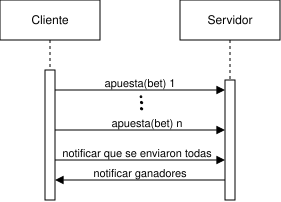
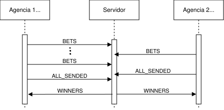

Redactar un breve informe en donde se detallen los aspectos más importantes de la solución provista, como ser el protocolo de comunicación implementado y los mecanismos para sincronizar la ejecución concurrente.

# Protocolo de comunicación
Para lograr el coportamiento enunciado, planteamos el siguiente diagrama de secuencia que de forma burda describe la interacción entre las aplicaciones que en este caso usan la arquitectra cliente-servidor. 
Notando que el cliente en el dominio actua como agencia de lotería que cargan participantes en el sevidor, este último es el responsable de comunicar a quiénes hayan ganado su premio.

  

Para eso definimos el protocolo de comunicación de capa de aplicación, teniendo en cuenta de que la capa de transporte usará TCP, tendrá los siguientes mensajes divididos según su funcionalidad:

- Para enviar información del flujo de apuestas
    - BETS: Este mensaje puede contener tantos registros de apuestas como entren en un batch definido en la variable de entorno `BATCH_SIZE`.
    - WINNERS: Este mensaje puede contener tantos registros de apuestas ganadoras de la agencia destino como entren en un batch, puede no contener registros. Además indica el fin de la comunicación entre estos.
    - ERROR: Este mensaje indica que hubo un error en la comunicación, por lo que el cliente debe cerrar la conexión con el servidor.   

- De control
    - ALL_SENDED: Este mensaje indica que el cliente ha enviado todos los registros de apuestas que tenía para enviar.

## Flujo de comunicación
En el siguiente diagrama se muestra el flujo de comunicación esperado, en este caso hay dos clientes.

El cliente/agencia 1, envía varios batches de apuestas (es decir mensajes que contienen tantos rgistros de apuestas como entren en el batch), lo cual lo hace mediante el mensaje **BETS**.
Luego de que haya mandado todos los registros de apuestas, envía el mensaje **ALL_SENDED** para notificar al servidor que ya no enviará más apuestas; es en este punto que el cliente debe quedar a la espera de recibir un mensaje con los ganadores de su agencia o bien vacío si ninguna de sus apuestas fue ganadora.
Análogamente actúa la agencia 2, pero es importante notar que luego de que ambas agencias hayan enviado todas sus apuestas el servidor calcula el ganador.

> NOTA: Para el ejercicio numero 7, se considera que el `AGENCY_QUORUM_MIN` es 2 o bien el servidor solo tiene esas dos conexiones.?

  

En caso de que haya algún tipo de error en la comunicación tanto servidor como cliente deben cerrar la conexión y terminar la ejecución, sea interno o por un mesaje recibido. 
## Estructuras de mensajes
